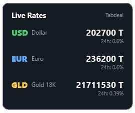

# Tabdeal Market Rates (Rainmeter Skin)

[](https://www.rainmeter.net/)
[](LICENSE)
[](https://tabdeal.org/)

A clean, modern, dark-themed Rainmeter desktop widget that displays real-time **USD Dollar**, **Euro**, and **18K Gold (طلای ۱۸ عیار)** prices in Tomans along with 24-hour percentage changes, fetched directly from Tabdeal's public API.

---

## ✨ Features

- 💵 **Live USD Dollar (دلار)** price in Tomans.
- 💶 **Live Euro (یورو)** price in Tomans.
- 🪙 **Live 18K Gold (طلای ۱۸ عیار)** price in Tomans.
- 📈 **24h Percentage Change** for each asset.
- 🔄 **Auto-update** every 5 minutes (customizable).
- ⚡ **Click-to-Refresh**: Click anywhere on the skin to instantly fetch the latest rates.
- 🎨 **Sleek Minimal Dark UI**: Rounded corners, clean typography, and subtle colored accent tags.
- 🔢 **Auto Comma Formatting**: Formatted price delimiters for easy reading (e.g. `21,596,100 T`).

---

## 🚀 Installation

### Manual Installation
1. Ensure [Rainmeter](https://www.rainmeter.net/) is installed on your Windows PC.
2. Clone or download this repository.
3. Move the `tabdealRates` folder into your Rainmeter Skins directory:
   ```
   %USERPROFILE%\Documents\Rainmeter\Skins\tabdealRates
   ```
4. Open the Rainmeter Manage window, click **Refresh all** at the bottom left.
5. Expand `tabdealRates`, select `tabdealRates.ini`, and click **Load**.

### Clone via Git
```powershell
cd "$HOME\Documents\Rainmeter\Skins"
git clone https://github.com/amirr3zza/tabdealRates.git
```
Then refresh Rainmeter and load `tabdealRates.ini`.

---

## ⚙️ Configuration & Customization

You can customize colors, card dimensions, fonts, and update frequencies by editing [tabdealRates.ini](tabdealRates.ini):

- **Update Frequency**: Change `UpdateRate` in `[MeasureParent]` or `[MeasureGoldParent]` (default is `300` seconds / 5 minutes).
- **Colors**: Modify RGBA values under `[Variables]`:
  - `DollarColor` (Default: green `68,207,110,255`)
  - `EuroColor` (Default: blue `90,170,255,255`)
  - `GoldColor` (Default: gold `255,200,60,255`)
  - `BgColor` (Default: dark slate `22,27,34,230`)
- **Font**: Change `FontName=Segoe UI` to any font installed on your system (e.g., `Vazirmatn`, `IRANSans`, `Inter`, `Roboto`).

---

## 🌐 API Reference

Data is retrieved via GET requests from Tabdeal's public endpoints:
- **Currencies**: `https://api-web.tabdeal.org/r/festival/get-asset-prices/?asset_type=currency`
- **Gold**: `https://api-web.tabdeal.org/r/festival/get-asset-prices/?asset_type=gold`

---

## 📄 License

This project is licensed under the [MIT License](LICENSE).
